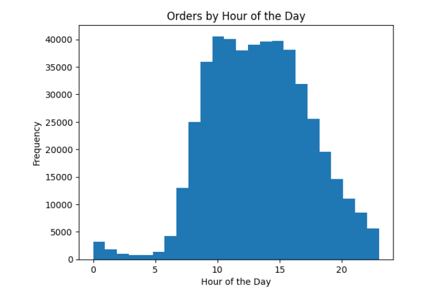
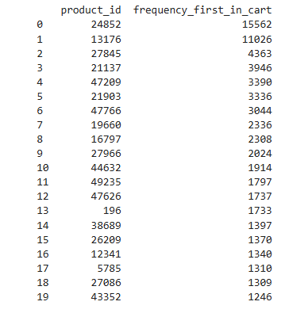

# Sprint 2 Project: Exploratory Data Analysis (EDA)

---

### 📚 Table of Contents
- 🔍 [Project Overview](#project-overview)
- 📈 [Conclusion](#conclusion)
- 🖼️ [Sample Outputs](#sample-outputs)
- 📁 [Files](#files)

---

## Project Overview

For this project, you’ll work with data from Instacart. 

Instacart is a grocery delivery platform where customers can place a grocery order and have it delivered to them, similar to how Uber Eats and Door Dash work. This particular dataset was publicly released by Instacart in 2017 for a Kaggle competition. Although the original dataset is no longer available on the Instacart website, we’ve created CSV files that contain a modified version of that data. Download these files and use them for your project.

The dataset we've provided for you has been modified from the original. We've reduced the size of the dataset so that your calculations run faster and we’ve introduced missing and duplicate values. We were also careful to preserve the distributions of the original data when we made our changes.

Your mission is to clean up the data and prepare a report that gives insight into the shopping habits of Instacart customers. After answering each question, write a brief explanation of your results in a markdown cell of your Jupyter notebook.

This project will require you to make plots that communicate your results. Make sure that any plots you create have a title, labeled axes, and a legend if necessary; and include plt.show() at the end of each cell with a plot.

---

## Conclusion

This exploratory analysis examined hourly ordering patterns across a large grocery dataset. The most common order times were between 9:00 AM and 3:00 PM, peaking at 10:00 AM. These findings suggest that customer activity is concentrated in the late morning and early afternoon, possibly reflecting regular grocery habits rather than late-night or impulsive behavior. The dataset was cleaned and summarized successfully, and the visualizations provide a solid foundation for further analysis or modeling.

---

## Sample Outputs

Here are two key moments from the analysis:

  
*Most orders occur between 9 AM and 3 PM, with a peak at 10 AM.*

 

  
*Top 20 products most frequently added first to customers' shopping carts.*

---

## Files

📄 See the full analysis in [`sprint-02-project.ipynb`](./sprint-02-project.ipynb)  
📄 Or view a static version in [`sprint-02-project.html`](./sprint-02-project.html)  
📄 Project background: [`project-description.md`](./project-description.md)

> Note: This project uses five CSV files, four of which are included in the `/data/` folder.  
> The fifth file, `order_products.csv`, was omitted due to GitHub file size limits.  
> See [`/data/README.md`](./data/README.md) for details.
